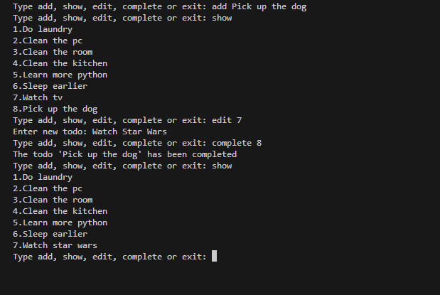
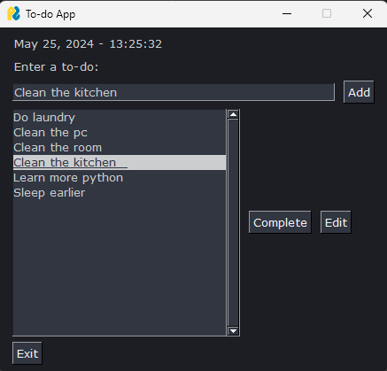
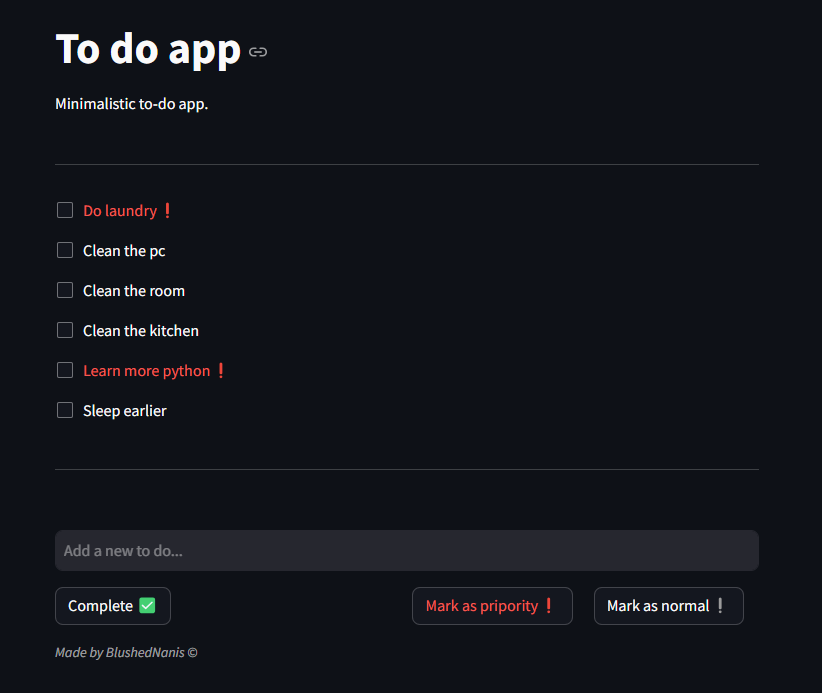

# To-Do List

To-do list checker: a straightforward application available in three versions (CLI, GUI, and Web-App).

* CLI (Command Line interface)

  
* GUI (Graphical User Interface / Desktop app)

  
* Web-App

  
